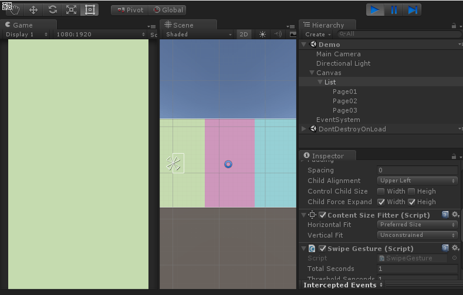

# Unity-PageTransitionRx

## Overview

A demonstration of page transition, it looks almost same as what [Clash Royale](https://clashroyale.com/) does. (I bet you already know what the game is)

Another interesting things, if you like Rx, there is also code implements swipe gesture with UniRx. See [SwipeGestrue.cs](https://github.com/kimsama/Unity-PageTransitionRx/blob/master/Assets/Scripts/SwipeGesture.cs) to see how it works.

Run *'Demo'* scene which can be found under the *Scene* folder.

  
</p

The original post can be found on here: [Page transition with using uGUI and UniRx.](http://qiita.com/lycoris102/items/1c792c4ba78e564a1b21) (Japanese, so you may need to use google translation)
No git or any other repository can be found on the blog post, so the reason why this repository goes.

## Requirement

The project of the repository written with Unity 5.6.0f3 (But the version of Unity may  not matter.)

Also it relies on external libraries as the followings:

* [UniRx](https://github.com/neuecc/UniRx)
* [DoTween](https://github.com/Demigiant/dotween)

## Getting UniRx How

Note UniRx is being in the diffrent repository. Pulling a Unity project into another Unity project with submodule or subtree of git can be a hard job, even a case we only need partial of the repository like pulling some of code under a specific subdirectory.  For *UniRx*, we only need to pull code under *'Assets/Plugins/UniRx'* into our Unity project.

Instead of using submodule or subtree, tried to get UniRx into this repository as the following instruction:

* [Merge a subdirectory of another repository with git](https://bneijt.nl/blog/post/merge-a-subdirectory-of-another-repository-with-git/)

This approach is much better than using submodule or subtree, it can easily to pull any subdirectory under a Unity's Assets folder without a problem.
